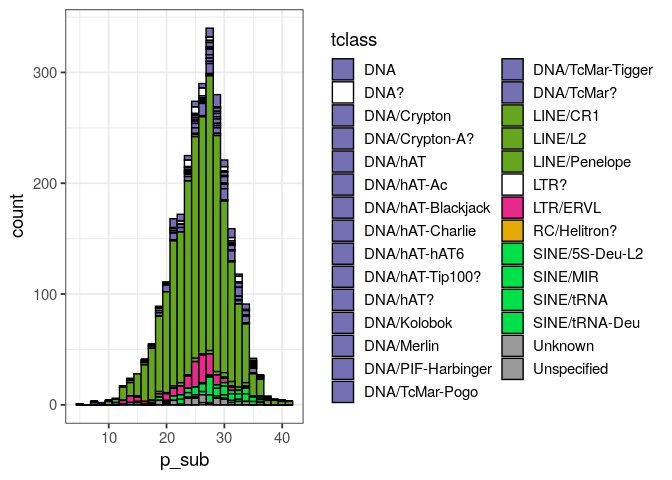

<!-- README.md is generated from README.Rmd. Please edit that file -->
# repeatR

Read and analyse RepeatMasker output in R.

Very early in development!

## install

``` r
library(devtools)
install_github("dwinter/repeatR")
```

# A basic usage

The package comes with a small example dataset, including the repeats from one scaffold in the [kākāpō assembly](https://www.ncbi.nlm.nih.gov/assembly/GCF_004027225.2/). We can read this file in memory using `read_rm`

``` r
library(repeatR)
#> Loading required package: dplyr
#> 
#> Attaching package: 'dplyr'
#> The following objects are masked from 'package:stats':
#> 
#>     filter, lag
#> The following objects are masked from 'package:base':
#> 
#>     intersect, setdiff, setequal, union
#> Loading required package: stringr
#> Loading required package: data.table
#> 
#> Attaching package: 'data.table'
#> The following objects are masked from 'package:dplyr':
#> 
#>     between, first, last
# create a file path relative to the installed package, this step is not
# necessary for normal usage
rm_file <- system.file("extdata", "kakapo.out", package="repeatR")
kakapo <- read_rm(rm_file)
kakapo
#> RepeatMasker output with  3496  entries for  3382 unique repeat sequences
#>   score p_sub p_del p_ins       qname qstart qend  qextend complement
#> 1    13  22.0   0.0   4.5 NC_044289.2    774  819 16475341          +
#> 2   993  25.1   5.5   0.0 NC_044289.2   2297 2567 16473593          C
#> 3   751  30.3   1.5   4.2 NC_044289.2   3418 3758 16472402          C
#>         tname         tclass tstart tend textend     ID ali_type
#> 1      G-rich Low_complexity      1   44       0 376812  primary
#> 2    TguLTR5d       LTR/ERVL      8  293     302 376814  primary
#> 3 CR1-Y2_Aves       LINE/CR1   3007 3338       1 376815  primary
```

As you can see, the function reads tdata and returns a `data.frame` with the alignment information from RepeatMasker.We can now quickly look at the composition of the repeats alignments on this scaffold:

``` r
library(ggplot2)
ggplot(kakapo, aes(tclass)) + 
    geom_bar() + 
    coord_flip()  + 
    theme_bw(base_size=14) 
```


It is important to note, however, that the alignment between a reference genome and a given repeat element might be broken up over multiple rows in RepeatMakser output. This occurs when elements are nested within each other (a pattern that is very common for some elements in some species). `repeatR` provides a the function `summarise_rm_ID` to produce a new table with one row per unique element in the genome.

``` r
kakapo_aggregated <- summarise_rm_ID(kakapo)
head(kakapo_aggregated)
#>       ID score p_sub p_del p_ins       qname qstart  qend qlen  qextend
#> 1 376812    13  22.0   0.0   4.5 NC_044289.2    774   819   46 16475341
#> 2 376814   993  25.1   5.5   0.0 NC_044289.2   2297  2567  271 16473593
#> 3 376815   751  30.3   1.5   4.2 NC_044289.2   3418  3758  341 16472402
#> 4 376818   938  30.9   2.0   2.5 NC_044289.2   6657  7035  379 16469125
#> 5 376817   397  36.4   7.9   0.4 NC_044289.2   7038  7291  254 16468869
#> 6 376820   439  24.8   0.0   0.0 NC_044289.2  11629 11732  104 16464428
#>   n_aligned_segments complement       tname         tclass tstart tend tlen
#> 1                  1          +      G-rich Low_complexity      1   44   44
#> 2                  1          C    TguLTR5d       LTR/ERVL      8  293  286
#> 3                  1          C CR1-Y2_Aves       LINE/CR1   3007 3338  332
#> 4                  1          + CR1-Y2_Aves       LINE/CR1   3008 3331  324
#> 5                  1          C CR1-Y2_Aves       LINE/CR1    800 1072  273
#> 6                  1          C    TguLTR5d       LTR/ERVL    492  595  104
#>   ali_type
#> 1  primary
#> 2  primary
#> 3  primary
#> 4  primary
#> 5  primary
#> 6  primary
```

With this data, we can start to analyse the total amount of the scaffold covered by elements of different classes

``` r
ggplot(kakapo_aggregated, aes(qlen, tclass)) +
    geom_col() +
    theme_bw(base_size=14) +
    scale_x_continuous(labels=Mb_lab) 
```


Quite often, you will want to remove some fo the sequences that are included in the output file. For instance, simple repeats and low complexity regions. The function `filter_by_tclass` will remove thise sequences along with functional RNAs and `ARTEFACT` sequences.

``` r
kakapo_just_TEs <-  filter_by_tclass(kakapo_aggregated)
table(kakapo_just_TEs$tclass)
#> 
#>               DNA              DNA?       DNA/Crypton    DNA/Crypton-A? 
#>                74                43                13                 6 
#>           DNA/hAT        DNA/hAT-Ac DNA/hAT-Blackjack   DNA/hAT-Charlie 
#>                15                14                10                 3 
#>      DNA/hAT-hAT6   DNA/hAT-Tip100?          DNA/hAT?       DNA/Kolobok 
#>                38                 1                 4                26 
#>        DNA/Merlin DNA/PIF-Harbinger    DNA/TcMar-Pogo  DNA/TcMar-Tigger 
#>                15                96                 2                 8 
#>        DNA/TcMar?          LINE/CR1           LINE/L2     LINE/Penelope 
#>                 4              2049                35                 3 
#>              LTR?          LTR/ERVL      RC/Helitron?    SINE/5S-Deu-L2 
#>                 3               140                 1                32 
#>          SINE/MIR         SINE/tRNA     SINE/tRNA-Deu           Unknown 
#>                86                27                 2                55 
#>       Unspecified 
#>                 3
```

Or the distrbution of the `p_sub` statistic (the proportion of bases that different from the consensus element). The function `make_TE_pallete` includes a pre-defined pallete for the `tclass` column.

``` r
ggplot(kakapo_just_TEs, aes(p_sub, fill=tclass)) +
    geom_histogram(colour="black") +
    scale_fill_manual(values=make_TE_pallete(kakapo_aggregated)) +
    theme_bw(base_size=14) 
#> `stat_bin()` using `bins = 30`. Pick better value with `binwidth`.
```


