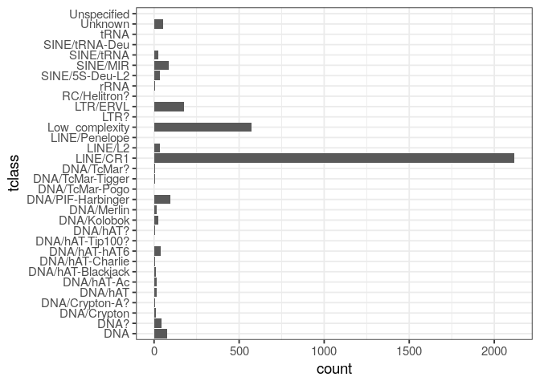
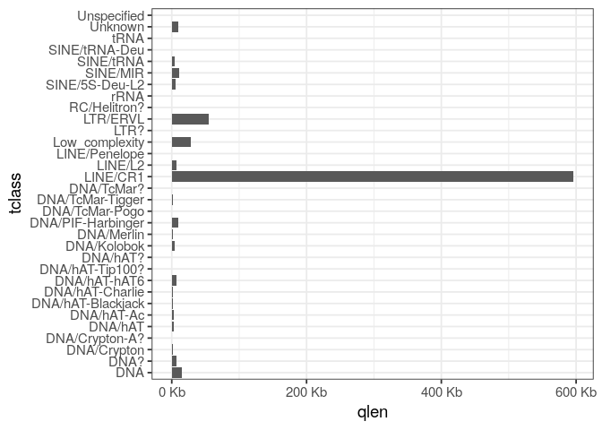
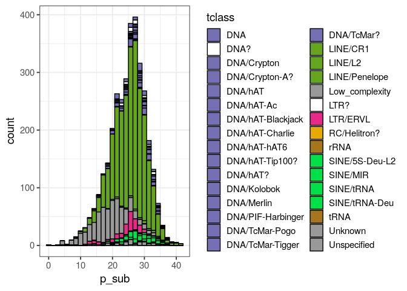

<!-- README.md is generated from README.Rmd. Please edit that file -->
# repeatR

Read and analyse RepeatMasker output in R.

Very early in development!

## install

``` r
library(devtools)
install_github("dwinter/repeatR")
```

# A basic usage

The package comes with a small example dataset, including the repeats from one scaffold in the [kākāpō assembly](https://www.ncbi.nlm.nih.gov/assembly/GCF_004027225.2/). We can read this file in memory using `read_rm`

``` r
library(repeatR)
# create a file path relative to the installed package, this step is not
# necessary for normal usage
rm_file <- system.file("extdata", "kakapo.out", package="repeatR")
kakapo <- read_rm(rm_file)
kakapo
#> RepeatMasker output with  3496  entries for  3382 unique repeat sequences
#>   score p_sub p_del p_ins       qname qstart qend  qextend complement
#> 1    13  22.0   0.0   4.5 NC_044289.2    774  819 16475341          +
#> 2   993  25.1   5.5   0.0 NC_044289.2   2297 2567 16473593          C
#> 3   751  30.3   1.5   4.2 NC_044289.2   3418 3758 16472402          C
#>         tname         tclass tstart tend textend     ID ali_type
#> 1      G-rich Low_complexity      1   44       0 376812  primary
#> 2    TguLTR5d       LTR/ERVL      8  293     302 376814  primary
#> 3 CR1-Y2_Aves       LINE/CR1   3007 3338       1 376815  primary
```

As you can see, the function reads tdata and returns a `data.frame` with the alignment information from RepeatMasker.We can now quickly look at the composition of the repeats alignments on this scaffold:

``` r
ggplot(kakapo, aes(tclass)) + 
    geom_bar() + 
    coord_flip()  + 
    theme_bw(base_size=14) 
```



It is important to note, however, that the alignment between a reference genome and a given repeat element might be broken up over multiple rows in RepeatMakser output. This occurs when elements are nested within each other (a pattern that is very common for some elements in some species). `repeatR` provides a the function `summarise_rm_ID` to produce a new table with one row per unique element in the genome.

``` r
kakapo_aggregated <- summarise_rm_ID(kakapo)
kakapo_aggregated
#> # A tibble: 3,382 x 18
#>    ID    score p_sub p_del p_ins qname qstart  qend  qlen qextend
#>    <chr> <dbl> <dbl> <dbl> <dbl> <chr>  <dbl> <dbl> <dbl>   <dbl>
#>  1 3768…    13  22    0     4.5  NC_0…    774   819    46  1.65e7
#>  2 3768…   993  25.1  5.5   0    NC_0…   2297  2567   271  1.65e7
#>  3 3768…   751  30.3  1.5   4.2  NC_0…   3418  3758   341  1.65e7
#>  4 3768…   397  36.4  7.9   0.4  NC_0…   7038  7291   254  1.65e7
#>  5 3768…   938  30.9  2     2.5  NC_0…   6657  7035   379  1.65e7
#>  6 3768…   439  24.8  0     0    NC_0…  11629 11732   104  1.65e7
#>  7 3768…   974  25.3  4.70  4.37 NC_0…  11733 11989   257  1.65e7
#>  8 3768…  2296  27.9  0.80  1.60 NC_0…  12450 13098   649  1.65e7
#>  9 3768…    22  20.8  0     0    NC_0…  14727 14770    44  1.65e7
#> 10 3768…   308  14.6  0     0    NC_0…  18280 18334    55  1.65e7
#> # … with 3,372 more rows, and 8 more variables: n_aligned_segments <int>,
#> #   complement <chr>, tname <chr>, tclass <chr>, tstart <chr>, tend <dbl>,
#> #   tlen <dbl>, ali_type <chr>
```

With this data, we can start to analyse the total amount of the scaffold covered by elements of different classes

``` r
ggplot(kakapo_aggregated, aes(qlen, tclass)) +
    geom_col() +
    theme_bw(base_size=14) 
```



Or the distrbution of the `p_sub` statistic (the proportion of bases that different from the consensus element)

``` r
ggplot(kakapo_aggregated, aes(p_sub, fill=tclass)) +
    geom_histogram(colour="black") +
    theme_bw(base_size=14) 
#> `stat_bin()` using `bins = 30`. Pick better value with `binwidth`.
```


